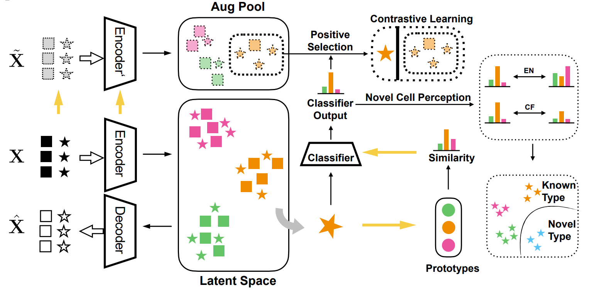

.. image:: ./_static/scPLAN.png
    :alt: scPLAN
    :align: center

.. inclusion-marker-do-not-remove

scPLAN
========================

|Python compat| |PyPi|

| A hierarchical computational framework for single transcriptomics data annotation, integration and cell-type label refinement

==============

Motivation
========

In the past decade, single-cell RNA sequencing (scRNA-seq) has emerged as a pivotal method for transcriptomic profiling in biomedical research. Precise cell-type identification is crucial for subsequent analysis of single-cell data. And the integration and refinement of annotated data are essential for building comprehensive databases. However, prevailing annotation techniques often overlook the hierarchical organization of cell types, resulting in inconsistent annotations. Meanwhile, most existing integration approaches fail to integrate datasets with different annotation depths and none of them can enhance the labels of outdated data with lower annotation resolutions using more intricately annotated datasets or novel biological findings.

Here, we introduce scPLAN, a hierarchical computational framework designed for scRNA-seq data analysis. scPLAN excels in annotating unlabeled scRNA-seq data using a reference dataset structured along a hierarchical cell-type tree. It identifies potential novel cell types in a systematic, layer-by-layer manner. Additionally, scPLAN effectively integrates annotated scRNA-seq datasets with varying levels of annotation depth, ensuring consistent refinement of cell-type labels across datasets with lower resolutions. Through extensive annotation and novel cell detection experiments, scPLAN has demonstrated its efficacy. Two case studies have been conducted to showcase how scPLAN integrates datasets with diverse cell-type label resolutions and refine their cell-type labels.

Installation
============

scplan requires Python ``>=3.8`` and can be installed via:

.. code-block:: bash

   python -m pip install git+https://github.com/michaelGuo1204/scPLAN.git

Tutorial
===========

Docs and tutorials could be found in https://michaelguo1204.github.io/scPLAN/

.. |Python compat| image:: https://img.shields.io/badge/>=python-3.8-blue.svg
.. |PyPi| image:: https://img.shields.io/pypi/v/scplan.svg
        :target: https://pypi.python.org/pypi/scplan
